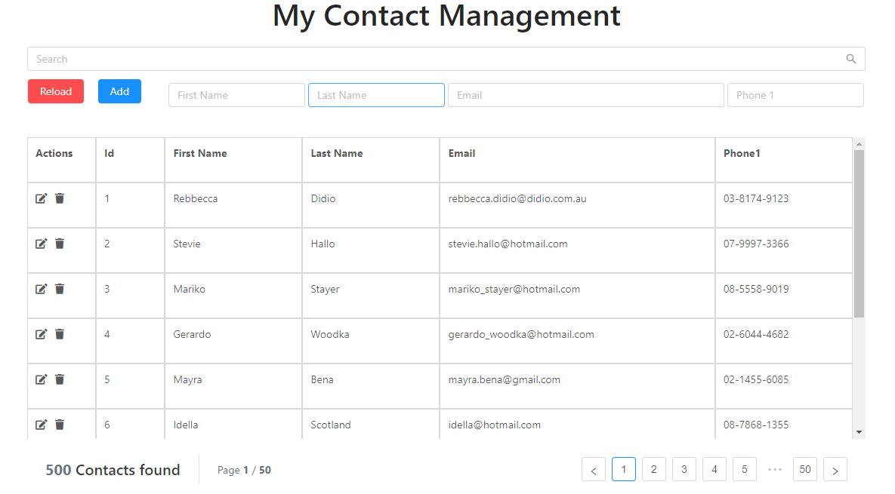

# AspNetCore Template

## Get started

The SPA is located under the `app` folder.

Then to start the dev server, run this command:

`npm run dev`

Fire up the AspNetCore app from Visual Studio and browse to `http://locahost:5000`

## Build

To publish the app, go to AspnetCoreSPA folder and run this command

`dotnet publish AspnetCoreSPATemplate.csproj -o ../Publish`

## Assumptions

The page is an Single Page App uses ASP.NET core and React. It loads data from database (MS SQL) through API and display how many records are loaded. 
We can also click on page number to navigate between pages. The list, number of contacts/pages and pagination will get refreshed as user types in search bar. User can also perform updating/deleting a record or or click Reload to reset all data. Here is a screen-shot.

